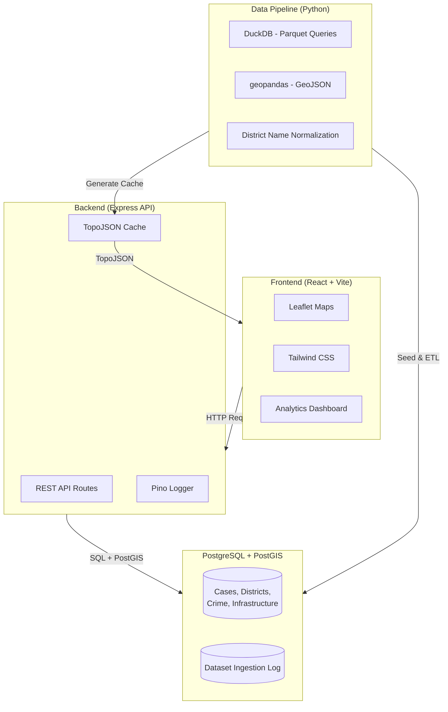

# India Civic Transparency Platform

[](LICENSE)


A full-stack civic data platform that visualizes Indian public datasets to help citizens understand government systems — Supreme Court judgments, crime statistics, district-level geographic data, and infrastructure development.

## Architecture



## Tech Stack

| Layer | Technology |
|-------|-----------|
| Frontend | React 18, TypeScript, Vite, Leaflet 1.9, Tailwind CSS 4.2 |
| Backend | Node.js, Express 4.21 |
| Database | PostgreSQL 16, PostGIS 3.4 |
| Data Pipeline | Python, DuckDB, geopandas, boto3 |
| Logging | pino (backend), Python logging (ETL) |
| Caching | Pre-generated TopoJSON files |

## Features

- **Interactive map of India** — Leaflet Canvas 2D renderer, zoom to districts, click for detail
- **Supreme Court cases** — paginated search and browse with case metadata
- **Crime registrations layer** — district-level NCRB data as proportional circle markers with "no data" indicators
- **Infrastructure layer** — status-colored markers (completed/in-progress/sanctioned) at district centroids
- **Layer controls** — toggle districts, crime, and infrastructure layers with opacity slider
- **Analytics dashboard** — judicial delay trends, crime-vs-justice comparison, composite district scores
- **Dataset versioning** — every record tracks source, version, and ingestion timestamp
- **Structured logging** — JSON logs for backend API and ETL pipeline

## Datasets

| Dataset | Source | Format |
|---------|--------|--------|
| Supreme Court Judgments | `s3://indian-supreme-court-judgments/` (AWS Open Data) | Parquet |
| District Boundaries | DataMeet India | GeoJSON |
| NCRB Crime Data | National Crime Records Bureau | CSV |
| Infrastructure (PMGSY) | Placeholder for road data | JSON |

## Prerequisites

- **Node.js** 18+ ([download](https://nodejs.org/))
- **Python** 3.9+ ([download](https://www.python.org/))
- **PostgreSQL** 14+ with PostGIS, **or** Docker ([download](https://www.docker.com/))

## Quick Start

### 1. Clone and setup

```bash
git clone <repository-url>
cd india-civic-transparency

# Automated setup (Linux/macOS)
make setup

# Windows PowerShell
.\scripts\setup.ps1
```

### 2. Start the database

```bash
# Using Docker (recommended)
make db-up

# Or use an existing PostgreSQL instance — edit backend/.env
```

### 3. Create schema and seed data

```bash
make db-schema
make seed
```

### 4. Start development

```bash
make dev
```

- **Frontend**: http://localhost:5173
- **Backend API**: http://localhost:3000
- **Health check**: http://localhost:3000/api/health

## Running the Full ETL Pipeline

To ingest real datasets (requires internet access):

```bash
# Run full pipeline with a version tag
make etl-version VERSION=2024-Q4

# Or run with auto-generated version (today's date)
make etl
```

## API Endpoints

### Data Endpoints

| Method | Path | Description |
|--------|------|-------------|
| GET | `/api/health` | Health check |
| GET | `/api/cases` | List Supreme Court cases (paginated, searchable) |
| GET | `/api/cases/:id` | Single case details |
| GET | `/api/districts` | List districts (no geometry) |
| GET | `/api/districts/topojson` | TopoJSON boundaries (cached) |
| GET | `/api/districts/:id` | District detail with geometry |
| GET | `/api/crime` | Crime statistics (filterable) |
| GET | `/api/crime/geo` | Crime counts with district centroids |
| GET | `/api/crime/summary` | Aggregated crime by state/year |
| GET | `/api/infrastructure` | Infrastructure projects |
| GET | `/api/infrastructure/geo` | Projects with district centroids |
| GET | `/api/datasets` | Ingested dataset versions |
| GET | `/api/datasets/:name` | Version history for a dataset |

### Analytics Endpoints

| Method | Path | Description |
|--------|------|-------------|
| GET | `/api/analytics/judicial-delay` | Average case disposal time by year |
| GET | `/api/analytics/crime-vs-justice` | Crime rate vs conviction rate by district |
| GET | `/api/analytics/district-score` | Composite transparency/development score |

All data and analytics endpoints accept an optional `?dataset_version=` parameter for reproducible queries.

## Logging

Structured logs are written to the `/logs` directory:

- `logs/backend.log` — JSON-formatted backend API logs (pino)
- `logs/etl-pipeline.log` — ETL pipeline execution logs (Python logging)

```bash
# Tail logs in real-time
make logs-tail
```

## Dataset Versioning

Every ingested record carries:

- `dataset_source` — origin identifier (e.g., `datameet`, `ncrb`, `s3://...`)
- `dataset_version` — version tag (e.g., `2024-Q4`, `seed-v1`)
- `ingested_at` — UTC timestamp of ingestion

The `dataset_ingestion_log` table provides an audit trail of all ingestions.

## Makefile Targets

| Target | Description |
|--------|-------------|
| `make setup` | Install all dependencies |
| `make db-up` | Start PostgreSQL via Docker |
| `make db-schema` | Apply database schema |
| `make seed` | Load seed data for demo |
| `make etl` | Run full ETL pipeline |
| `make etl-version VERSION=X` | Run ETL with explicit version |
| `make cache` | Regenerate TopoJSON cache |
| `make dev` | Start backend + frontend |
| `make logs-tail` | Tail log files |
| `make clean` | Stop DB, remove caches and logs |

## Project Structure

```
india-civic-transparency/
├── backend/          Express API server
├── data_pipeline/    Python ETL scripts
├── frontend/         React + Leaflet + Tailwind CSS application
├── logs/             Structured log output
├── scripts/          Developer automation
└── seed_data/        Demo datasets for instant setup
```

## Contributing

See [CONTRIBUTING.md](CONTRIBUTING.md) for guidelines.

## Security

See [SECURITY.md](SECURITY.md) for vulnerability reporting.

## License

This project is licensed under the [MIT License](LICENSE).


