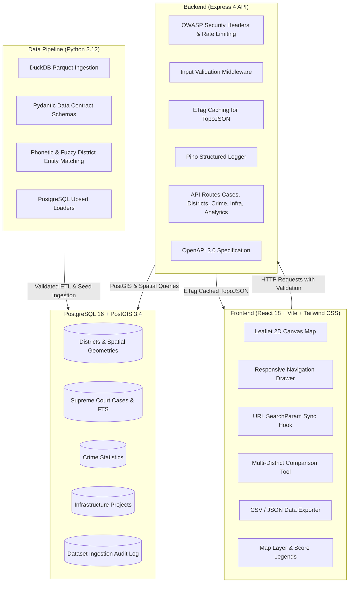

# India Civic Transparency Platform

[](LICENSE)


A full-stack open civic data visualization and analytics platform for Indian public datasets: Supreme Court judgments, crime statistics, district-level geographic geometries, and infrastructure development projects.

## Architecture


```mermaid
flowchart TB
    subgraph Frontend["Frontend (React 18 + Vite + Tailwind CSS)"]
        Leaflet[Leaflet 2D Canvas Map]
        Drawer[Responsive Navigation Drawer]
        URLState[URL SearchParam Sync Hook]
        Compare[Multi-District Comparison Tool]
        Export[CSV / JSON Data Exporter]
        Legend[Map Layer & Score Legends]
    end

    subgraph Backend["Backend (Express 4 API)"]
        Security[OWASP Security Headers & Rate Limiting]
        Validation[Input Validation Middleware]
        ETagCache[ETag Caching for TopoJSON]
        Pino[Pino Structured Logger]
        Routes[API Routes Cases, Districts, Crime, Infra, Analytics]
        OpenAPI[OpenAPI 3.0 Specification]
    end

    subgraph Database["PostgreSQL 16 + PostGIS 3.4"]
        Districts[(Districts & Spatial Geometries)]
        Cases[(Supreme Court Cases & FTS)]
        Crime[(Crime Statistics)]
        Infra[(Infrastructure Projects)]
        Ingestion[(Dataset Ingestion Audit Log)]
    end

    subgraph Pipeline["Data Pipeline (Python 3.12)"]
        DuckDB[DuckDB Parquet Ingestion]
        Pydantic[Pydantic Data Contract Schemas]
        Normalize[Phonetic & Fuzzy District Entity Matching]
        Loaders[PostgreSQL Upsert Loaders]
    end

    Frontend -->|HTTP Requests with Validation| Backend
    Backend -->|PostGIS & Spatial Queries| Database
    Pipeline -->|Validated ETL & Seed Ingestion| Database
    Backend -->|ETag Cached TopoJSON| Frontend
```

## Features

- **Interactive 2D Canvas Map** — High-performance Leaflet canvas renderer with district boundaries, crime overlays, infrastructure markers, and color-coded score legends.
- **URL Parameter Synchronization** — Browser URL search parameters reflect active tabs, selected districts, layer toggles, and opacity, enabling bookmarkable views.
- **Mobile Responsive Drawer** — Navigation drawer and layout adapting smoothly from mobile screens to desktop viewports.
- **Supreme Court Case Explorer** — Searchable by title, petitioner, respondent, judge filter, and year range with full-text search indexing.
- **Multi-District Comparison Tool** — Side-by-side metric comparison across crime safety, justice efficiency, infrastructure, and transparency scores.
- **Client-Side Data Exports** — One-click CSV and JSON exports for search results, crime summaries, and district scores.
- **Enterprise Security & Validation** — OWASP security headers (CSP, X-Frame-Options, HSTS), sliding-window rate limiting, and strict input validation schemas.
- **ETag Caching** — Conditional HTTP 304 caching for large district TopoJSON boundary files.
- **OpenAPI 3.0 Specification** — Comprehensive API documentation in `backend/openapi.yaml`.
- **Full Test Coverage** — Unit and integration tests across backend, frontend, and data pipeline.

## Quick Start

### 1. Automated Setup with Docker

```bash
# Clone repository
git clone https://github.com/Yourfiyan/india-civic-transparency.git
cd india-civic-transparency

# Start PostGIS, backend, and frontend
docker compose up -d
```

### 2. Manual Development Setup

```bash
# Start PostGIS database container
docker compose up -d postgres

# Apply database schema and seed data
make db-schema
make seed

# Run Backend
cd backend && npm install && npm run dev

# Run Frontend
cd frontend && npm install && npm run dev
```

- **Frontend Application**: http://localhost:5173
- **Backend API**: http://localhost:3000
- **Health Check**: http://localhost:3000/api/health
- **OpenAPI Specification**: `backend/openapi.yaml`

## Running Automated Tests

```bash
# Backend Integration Tests (Vitest + Supertest)
cd backend && npm test

# Frontend Component & API Tests (Vitest + Testing Library)
cd frontend && npm test

# Data Pipeline Tests (Pytest + Pydantic)
cd data_pipeline && .venv/bin/pytest tests/

# Performance Benchmarks (< 100ms verification)
node scripts/benchmark.js
```

## API Endpoints

All endpoints include parameter validation, rate limiting, and structured error responses:

| Method | Path | Description |
|---|---|---|
| GET | `/api/health` | Service health, uptime, and status |
| GET | `/api/cases` | Paginated Supreme Court judgments with search and filters |
| GET | `/api/cases/:id` | Single judgment details |
| GET | `/api/districts` | Lightweight district directory |
| GET | `/api/districts/topojson` | TopoJSON boundaries with ETag conditional 304 caching |
| GET | `/api/districts/:id` | District geometry, crime summary, and infrastructure projects |
| GET | `/api/crime` | Crime statistics with category and year filters |
| GET | `/api/crime/geo` | District centroids with total cases and convictions |
| GET | `/api/crime/summary` | State-level crime aggregations |
| GET | `/api/infrastructure` | Filterable infrastructure projects |
| GET | `/api/infrastructure/geo` | Project centroids and status markers |
| GET | `/api/analytics/judicial-delay` | Historical disposal durations by year |
| GET | `/api/analytics/crime-vs-justice`| Conviction rates vs crime cases |
| GET | `/api/analytics/district-score` | Composite governance and development scores |
| GET | `/api/datasets` | Ingestion audit trail and versions |

## License

This project is licensed under the [MIT License](LICENSE).
